This report explores a dataset containing attributes of 1,599 red wines.

Univariate Plots
================

    ## 'data.frame':    1599 obs. of  13 variables:
    ##  $ X                   : int  1 2 3 4 5 6 7 8 9 10 ...
    ##  $ fixed.acidity       : num  7.4 7.8 7.8 11.2 7.4 7.4 7.9 7.3 7.8 7.5 ...
    ##  $ volatile.acidity    : num  0.7 0.88 0.76 0.28 0.7 0.66 0.6 0.65 0.58 0.5 ...
    ##  $ citric.acid         : num  0 0 0.04 0.56 0 0 0.06 0 0.02 0.36 ...
    ##  $ residual.sugar      : num  1.9 2.6 2.3 1.9 1.9 1.8 1.6 1.2 2 6.1 ...
    ##  $ chlorides           : num  0.076 0.098 0.092 0.075 0.076 0.075 0.069 0.065 0.073 0.071 ...
    ##  $ free.sulfur.dioxide : num  11 25 15 17 11 13 15 15 9 17 ...
    ##  $ total.sulfur.dioxide: num  34 67 54 60 34 40 59 21 18 102 ...
    ##  $ density             : num  0.998 0.997 0.997 0.998 0.998 ...
    ##  $ pH                  : num  3.51 3.2 3.26 3.16 3.51 3.51 3.3 3.39 3.36 3.35 ...
    ##  $ sulphates           : num  0.56 0.68 0.65 0.58 0.56 0.56 0.46 0.47 0.57 0.8 ...
    ##  $ alcohol             : num  9.4 9.8 9.8 9.8 9.4 9.4 9.4 10 9.5 10.5 ...
    ##  $ quality             : int  5 5 5 6 5 5 5 7 7 5 ...

    ##        X          fixed.acidity   volatile.acidity  citric.acid   
    ##  Min.   :   1.0   Min.   : 4.60   Min.   :0.1200   Min.   :0.000  
    ##  1st Qu.: 400.5   1st Qu.: 7.10   1st Qu.:0.3900   1st Qu.:0.090  
    ##  Median : 800.0   Median : 7.90   Median :0.5200   Median :0.260  
    ##  Mean   : 800.0   Mean   : 8.32   Mean   :0.5278   Mean   :0.271  
    ##  3rd Qu.:1199.5   3rd Qu.: 9.20   3rd Qu.:0.6400   3rd Qu.:0.420  
    ##  Max.   :1599.0   Max.   :15.90   Max.   :1.5800   Max.   :1.000  
    ##  residual.sugar     chlorides       free.sulfur.dioxide
    ##  Min.   : 0.900   Min.   :0.01200   Min.   : 1.00      
    ##  1st Qu.: 1.900   1st Qu.:0.07000   1st Qu.: 7.00      
    ##  Median : 2.200   Median :0.07900   Median :14.00      
    ##  Mean   : 2.539   Mean   :0.08747   Mean   :15.87      
    ##  3rd Qu.: 2.600   3rd Qu.:0.09000   3rd Qu.:21.00      
    ##  Max.   :15.500   Max.   :0.61100   Max.   :72.00      
    ##  total.sulfur.dioxide    density             pH          sulphates     
    ##  Min.   :  6.00       Min.   :0.9901   Min.   :2.740   Min.   :0.3300  
    ##  1st Qu.: 22.00       1st Qu.:0.9956   1st Qu.:3.210   1st Qu.:0.5500  
    ##  Median : 38.00       Median :0.9968   Median :3.310   Median :0.6200  
    ##  Mean   : 46.47       Mean   :0.9967   Mean   :3.311   Mean   :0.6581  
    ##  3rd Qu.: 62.00       3rd Qu.:0.9978   3rd Qu.:3.400   3rd Qu.:0.7300  
    ##  Max.   :289.00       Max.   :1.0037   Max.   :4.010   Max.   :2.0000  
    ##     alcohol         quality     
    ##  Min.   : 8.40   Min.   :3.000  
    ##  1st Qu.: 9.50   1st Qu.:5.000  
    ##  Median :10.20   Median :6.000  
    ##  Mean   :10.42   Mean   :5.636  
    ##  3rd Qu.:11.10   3rd Qu.:6.000  
    ##  Max.   :14.90   Max.   :8.000

Distribution of Variables
-------------------------

Here I explore the distribution of all the variables

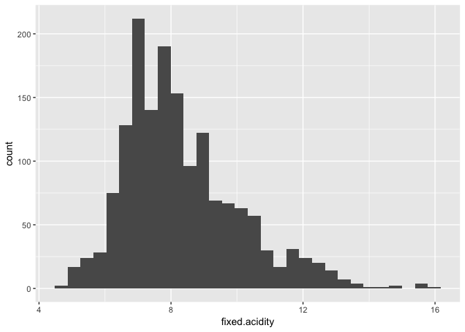

    ## [1] 0.8055034

It’s a right-skewed distribution with highest peak around 7 and the
second highest peak around 8. 80% of the wines have the fixed.acidity
between 6 to 10 gram per litter.

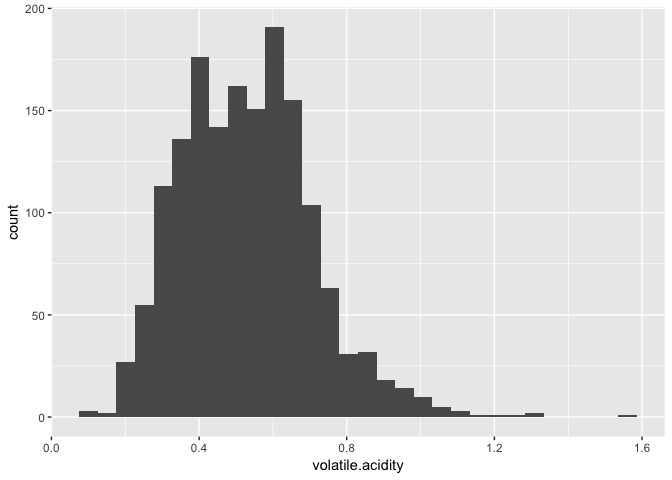

    ## [1] 0.1790597

    ## [1] 0.9631019

volatile.acidity has a normal distribution with mean=median = 0.52.
Standard Deviation is 0.18 and %96 of wines have a volatile.acidity
between 0.16 to 0.88.

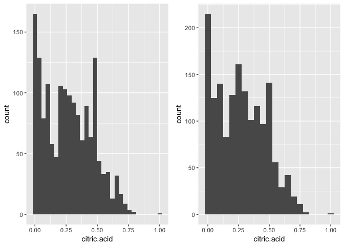

    ## [1] 0.9243277

It has a right skewed distribution with the highest peak around 0 (the
first quantile is 0.09). I changed the binwidth to 0.05 to have a better
understanding of data. It has two other peaks around 0.25 and 0.50. 92%
of data has a citric.acid less than 0.55 gram per litter.

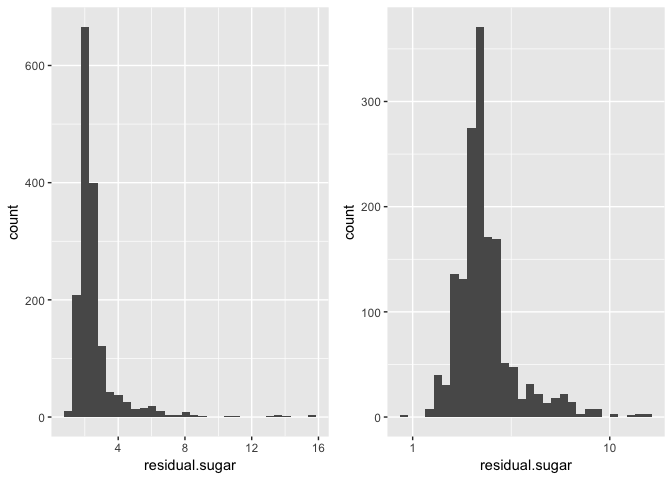

Residual Sugar has a long tail distribution with the highest peak around
2. While the maximum data is 15.5, 92% of data is less than 4. I
transformed the data to better understand the distribution of it. There
are 11 wines with residual sugar more than 9 gram per litter.

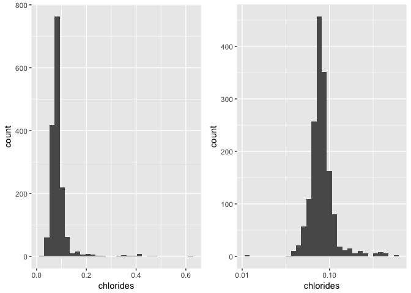

    ## [1] 22

I transformed the long tail data to better understand the distribution
of chlorides. The highest peak is around 0.08. 93% of data is less than
0.12. There are only 22 wines with chlorides greater than 0.3 gram per
litter.

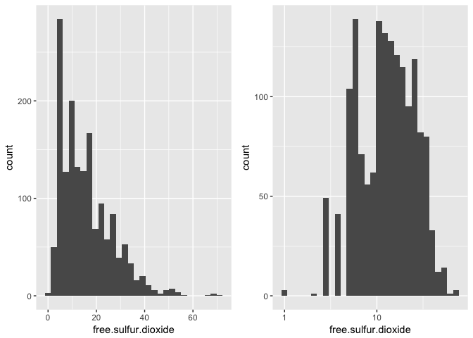

    ## [1] 4

I transformed the long tail left skewed data to better understand the
distribution of free.sulfur.dioxide. The transformed data looks bimodal
with on peak around 6 and another peak around 10. 90% of data is less
than 30. There are only 4 wines with free sulfur dioxide greater than 60
milligram per litter

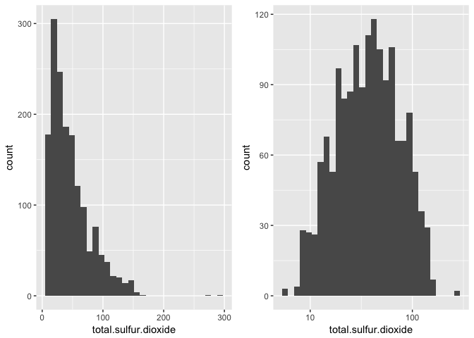

I transformed the long tail left skewed data to better understand the
distribution of total.sulfur.dioxide. The highest peak is around 20. 92%
of data is less than 100. There are 9 wines with total.sulfur.dioxide
greater than 150 milligram per litter

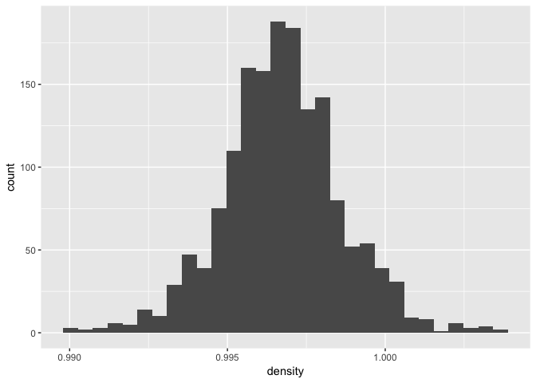

    ## [1] 0.001887334

Density has a normal distribution with a peak around 0.997. The standard
deviation is 0.002 with 96% of data between 0.993 to 1.001
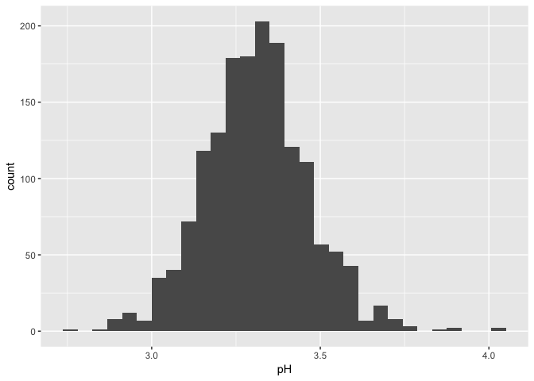

    ## [1] 0.1543865

pH has a normal distribution with a peak around 3.3. The standard
deviation is 0.15 with 95% of data between 3.0 to 3.6

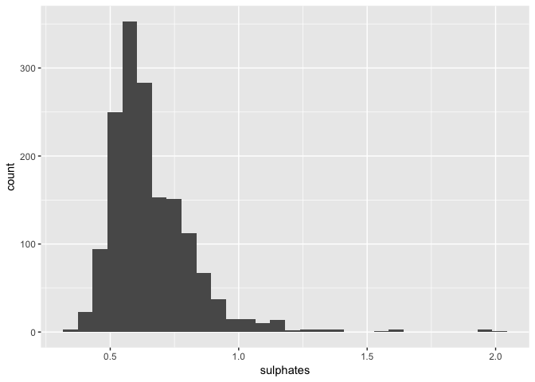

    ## [1] 0.169507

The highest peak is around 0.6. 96% of data is between 0.4 and 1.0.
There are 8 wines with Sulphates greater than 1.5 gram per litter.
Distribution of Sulphates and total.sulfur.dioxides are quite similar,
because sulphates contribute to sulfur dioxide gas levels

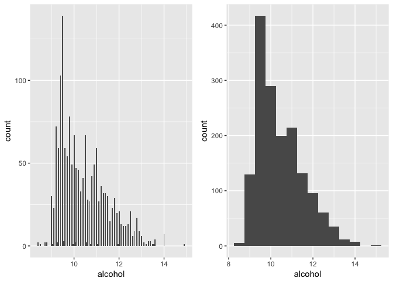

    ## [1] 0.9074422

I set the binwidth to 0.1 and then to 0.5 to have a better understanding
of data. Setting the binwidth to 0.1 indicates that most table values
have 1 digit after decimal point. It is a right skewed distribution with
the highest peak on 9.5. 91% of wines has between 9% to 12% of alcohol.

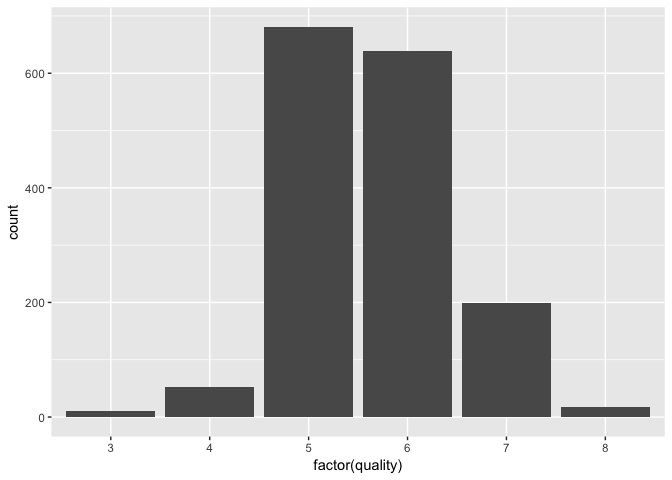

``` r
table(redwine$quality)
```

    ## 
    ##   3   4   5   6   7   8 
    ##  10  53 681 638 199  18

``` r
prop.table(table(redwine$quality))
```

    ## 
    ##           3           4           5           6           7           8 
    ## 0.006253909 0.033145716 0.425891182 0.398999375 0.124452783 0.011257036

Quality is a discrete data. 43% of the wines have a quality of 5. and
82% of wines have a quality of either 5 or 6. 4% less than 5 and 1% more
than 7.

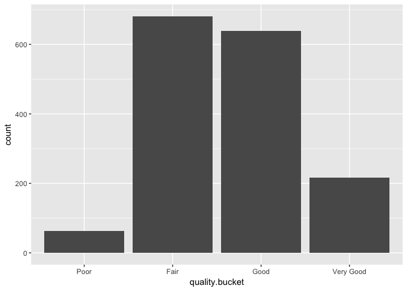

I created a new factor variable with the name of quality.bucket which
hast 4 levels: ‘Poor’ for wines with quality less than 5, ‘Fair’ for
wines with quality equal to 5, ‘Good’ for wines with quality equal to 6,
and ‘Very Good’ for wines with quality more than 6.

Univariate Analysis
===================

### What is the structure of your dataset?

There are 11 variables on the chemical properties of the wine and one
variable on quality of it. At least 3 wine experts rated the quality of
each wine, providing a rating between 0 (very bad) and 10 (very
excellent).

-   Input variables (based on physicochemical tests):
    -   fixed acidity (tartaric acid - g / dm^3)
    -   volatile acidity (acetic acid - g / dm^3)
    -   citric acid (g / dm^3)
    -   residual sugar (g / dm^3)
    -   chlorides (sodium chloride - g / dm^3
    -   free sulfur dioxide (mg / dm^3)
    -   total sulfur dioxide (mg / dm^3)
    -   density (g / cm^3)
    -   pH
    -   sulphates (potassium sulphate - g / dm3)
    -   alcohol (% by volume)
-   Output variable (based on sensory data): 12 - quality (score between
    0 and 10)

-   There is no missing attribute values(NA) in this dataset

### Other observations:

-   82% of wines have a quality of 5 or 6
-   There is no wine with quality less than 3 and more than 8
-   91% of wines has between 9% to 12% of alcohol.
-   The median alcohol percentage is 10.2%
-   95% of wines have a pH between 3.0 to 3.6 (Which means they are
    strongly acidic)
-   volatile.acidity has a normal distribution with mean=median = 0.52

### What are the main features of interest in the dataset?

I’d like to determine which features are more correlated to the quality
of a wine. Since the quality levels are assessed by human experts, I
suspect features that affect the taste of a wine will mostly correlate
to its quality. My main features of interest are acidity (fixex.acidity,
citric.acid, volatile.acidity, pH) and alcohol!

### Did you create any new variables from existing variables in the dataset?

I created a new factor variable with the name of quality.bucket which
hast 4 levels: ‘Poor’ for wines with quality less than 5, ‘Fair’ for
wines with quality equal to 5, ‘Good’ for wines with quality equal to 6,
and ‘Very Good’ for wines with quality more than 6.

### Of the features you investigated, were there any unusual distributions? Did you perform any operations on the data to tidy, adjust, or change the form of the data? If so, why did you do this?

I log-transformed the right skewed residual.sugar, chlorides,
free.sulfur.dioxide, and total.sulfur.dioxide distributions. The
transformed distribution for free.sulfur.dioxide appears to be bimodal
with the peaks around 6 and 10. There is also a great similarity between
the distribution of totoal.sulfur.dioxide and that of sulphates. I guess
that’s because sulphates contribute to sulfur dioxide gas levels

Bivariate Plots
===============

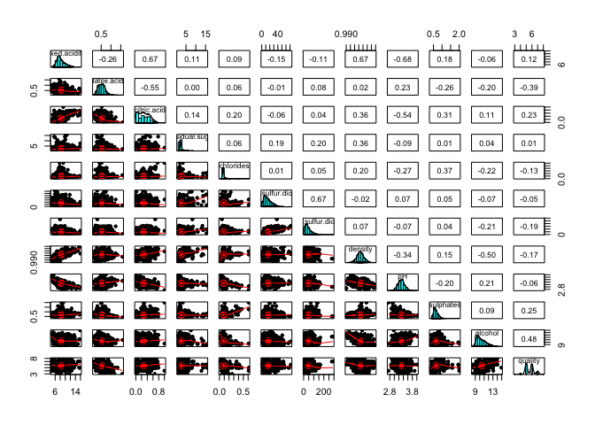
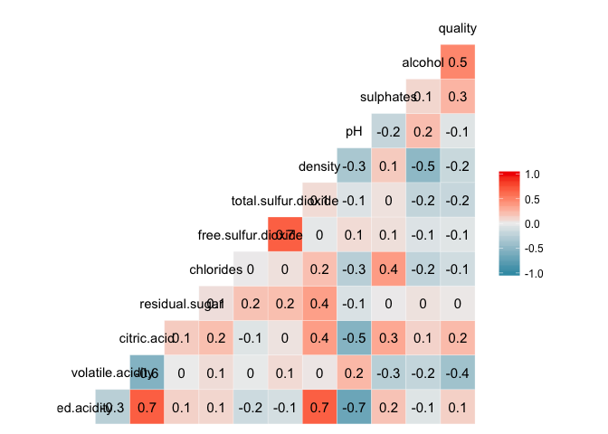

pH negatively correlates with fixed acidity and citric acid. That was
predictable because lower pH means higher level of acidity. There is not
a strong correlation between volatile acidity and pH. pH itself does not
correlate with Quality at all! The correlation between quality and none
of the wine attributes is strong. Alcohol, volatile acidity, sulphates
and citric acid have higher correlations with Quality than other wine
attributes.

First, I look closer into scatter plots involving pH and other acidity
variables:

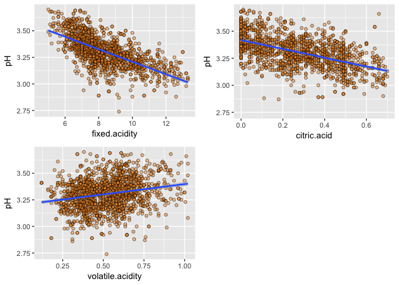

    ##    fixed.acidity volatile.acidity citric.acid
    ## pH    -0.6829782        0.2349373  -0.5419041

These plots show that pH has a strong correlation with fixed acidity. It
has a weak correlation with volatile acidity and a moderate correlation
with citric acid.

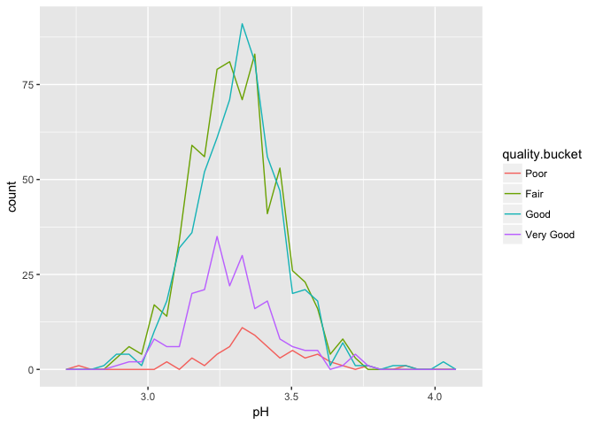

    ## redwine$quality.bucket: Poor
    ##    Min. 1st Qu.  Median    Mean 3rd Qu.    Max. 
    ##   2.740   3.300   3.380   3.384   3.500   3.900 
    ## -------------------------------------------------------- 
    ## redwine$quality.bucket: Fair
    ##    Min. 1st Qu.  Median    Mean 3rd Qu.    Max. 
    ##   2.880   3.200   3.300   3.305   3.400   3.740 
    ## -------------------------------------------------------- 
    ## redwine$quality.bucket: Good
    ##    Min. 1st Qu.  Median    Mean 3rd Qu.    Max. 
    ##   2.860   3.220   3.320   3.318   3.410   4.010 
    ## -------------------------------------------------------- 
    ## redwine$quality.bucket: Very Good
    ##    Min. 1st Qu.  Median    Mean 3rd Qu.    Max. 
    ##   2.880   3.200   3.270   3.289   3.380   3.780

    ## redwine$quality.bucket: Poor
    ## [1] 0.1751003
    ## -------------------------------------------------------- 
    ## redwine$quality.bucket: Fair
    ## [1] 0.1506184
    ## -------------------------------------------------------- 
    ## redwine$quality.bucket: Good
    ## [1] 0.1539951
    ## -------------------------------------------------------- 
    ## redwine$quality.bucket: Very Good
    ## [1] 0.1544777

The distribution of pH does not change over quality levels. They are all
normal distributions with Mean around 3.3 and with almost equal Standard
Deviation. It means, pH does not correlate with the quality of wine.

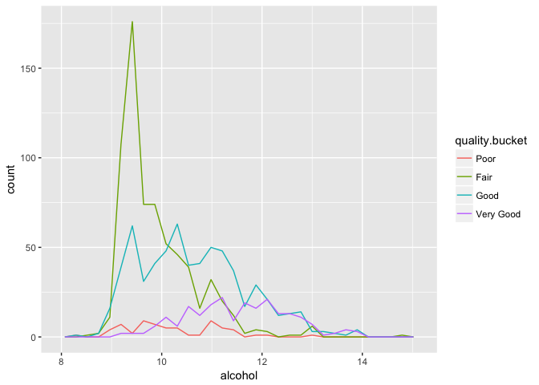

    ## redwine$quality.bucket: Poor
    ##    Min. 1st Qu.  Median    Mean 3rd Qu.    Max. 
    ##    8.40    9.60   10.00   10.22   11.00   13.10 
    ## -------------------------------------------------------- 
    ## redwine$quality.bucket: Fair
    ##    Min. 1st Qu.  Median    Mean 3rd Qu.    Max. 
    ##     8.5     9.4     9.7     9.9    10.2    14.9 
    ## -------------------------------------------------------- 
    ## redwine$quality.bucket: Good
    ##    Min. 1st Qu.  Median    Mean 3rd Qu.    Max. 
    ##    8.40    9.80   10.50   10.63   11.30   14.00 
    ## -------------------------------------------------------- 
    ## redwine$quality.bucket: Very Good
    ##    Min. 1st Qu.  Median    Mean 3rd Qu.    Max. 
    ##    9.20   10.80   11.60   11.52   12.20   14.00

    ## redwine$quality.bucket: Poor
    ## [1] 0.9181778
    ## -------------------------------------------------------- 
    ## redwine$quality.bucket: Fair
    ## [1] 0.736521
    ## -------------------------------------------------------- 
    ## redwine$quality.bucket: Good
    ## [1] 1.049639
    ## -------------------------------------------------------- 
    ## redwine$quality.bucket: Very Good
    ## [1] 0.9981532

In contrast with pH, the distribution of alcohol changes significantly
over quality levels. The mean and standard deviation is significantly
different for different quality levels. Obviously alcohol correlates
with the quality of wine.

Here I look closer at the scatter plots involving quality and some other
variables like pH, volatile acidity, sulphates, and alcohol:

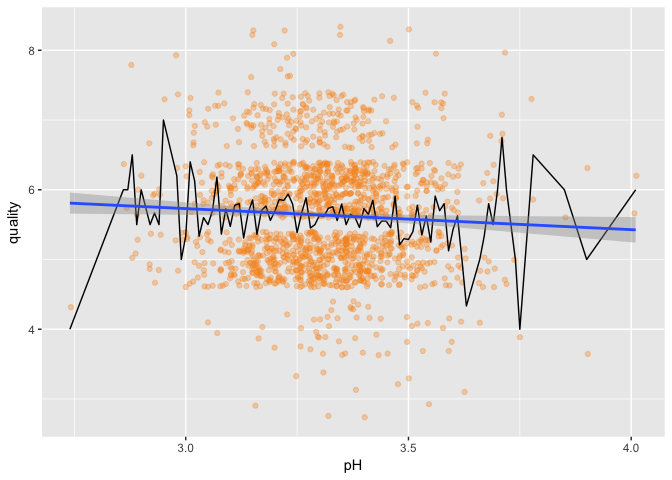

This scatter plot shows almost zero correlation between pH and Quality

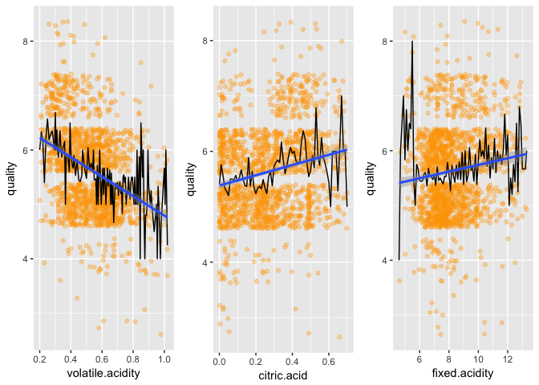

    ##         fixed.acidity volatile.acidity citric.acid
    ## quality     0.1240516       -0.3905578   0.2263725

When it comes to acidity, the level of correlation with quality is very
different among attributes. While volatile acidity is moderately
correlated, citric acid is weakly correlated and fixed acidity is very
weakly correlated. The direction of correlation is also different for
them. In contrast with fixed acidity and citric acid, volatile acidity
is negatively correlated to the wine quality. One reason could be the
effect of volatile acidity on the taste of the wine: “volatile acidity
is the amount of acetic acid in wine, which at too high of levels can
lead to an unpleasant, vinegar taste”. In contrast, citric acid can add
‘freshness’ and flavor to wines.

Volatile acidity also has a noisier plot in compare with citric acid and
fixed acidity. There is one outlier with volatile acidity slightly more
than 0.8 and quality of 8. There is no wine with quality more than 6
that has a volatile acidity more than 1.

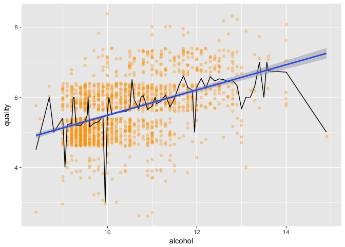

    ## alcohol.level: (0,9.5]
    ## [1] 0.2924813
    ## -------------------------------------------------------- 
    ## alcohol.level: (9.5,10.5]
    ## [1] 0.5266689
    ## -------------------------------------------------------- 
    ## alcohol.level: (10.5,11.5]
    ## [1] 0.6852684
    ## -------------------------------------------------------- 
    ## alcohol.level: (11.5,15]
    ## [1] 0.5525462

This plot shows a moderate correlation between Alcohol and Quality.
There are few outliers. Specifically, one outlier with almost 15% of
alcohol but with quality of 5. There is only one poor wine (quality 4 or
less) with alcohol more than 12%. The variance of quality over different
alcohol level is not significantly different. One reason could be that
over 84% of the wines have a quality of either 5 or 6.

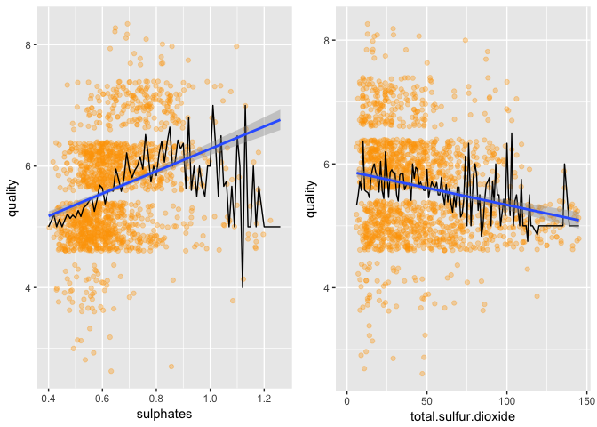

Sulphates weakly correlates with quality. Here, also there is a trend
that goes against my intuition. Sulphates is a wine additive which can
contribute to sulfur dioxide gas (S02) levels. But, while total sulfur
dioxide correlates negatively with quality, Sulphates correlates
positively. There are several outliers with sulphates less than 0.8 and
quality of 8. there are also several outliers with sulphates greater
than 1 and quality less than 5.

Here I create a new dataset. There is a row for each quality level in
which there are mean values of volatile acidity, total sulfur dioxide,
citric acid, sulphates, and alcohol for that level of quality. These are
wine attributes which have top correlation with quality.

    ## # A tibble: 4 x 7
    ##   quality.bucket volatile_mean sulfur_mean citric_mean sulphates_mean
    ##           <fctr>         <dbl>       <dbl>       <dbl>          <dbl>
    ## 1           Poor     0.7242063    34.44444   0.1736508      0.5922222
    ## 2           Fair     0.5770411    56.51395   0.2436858      0.6209692
    ## 3           Good     0.4974843    40.86991   0.2738245      0.6753292
    ## 4      Very Good     0.4055300    34.88940   0.3764977      0.7434562
    ## # ... with 2 more variables: alcohol_mean <dbl>, n <int>

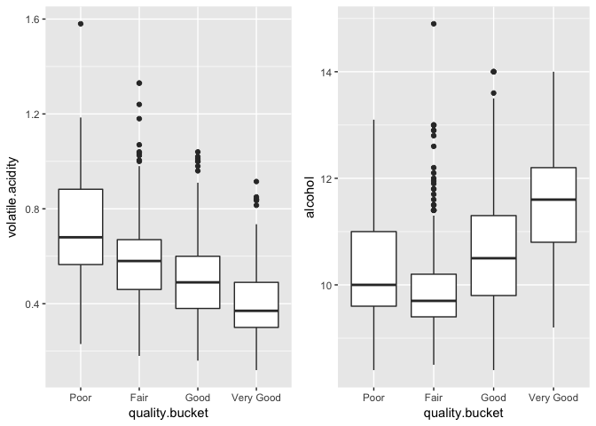

``` r
by(redwine$volatile.acidity, redwine$quality.bucket, summary)
```

    ## redwine$quality.bucket: Poor
    ##    Min. 1st Qu.  Median    Mean 3rd Qu.    Max. 
    ##  0.2300  0.5650  0.6800  0.7242  0.8825  1.5800 
    ## -------------------------------------------------------- 
    ## redwine$quality.bucket: Fair
    ##    Min. 1st Qu.  Median    Mean 3rd Qu.    Max. 
    ##   0.180   0.460   0.580   0.577   0.670   1.330 
    ## -------------------------------------------------------- 
    ## redwine$quality.bucket: Good
    ##    Min. 1st Qu.  Median    Mean 3rd Qu.    Max. 
    ##  0.1600  0.3800  0.4900  0.4975  0.6000  1.0400 
    ## -------------------------------------------------------- 
    ## redwine$quality.bucket: Very Good
    ##    Min. 1st Qu.  Median    Mean 3rd Qu.    Max. 
    ##  0.1200  0.3000  0.3700  0.4055  0.4900  0.9150

The ‘Very Good’ quality wines have the largest median and largest range
of Alcohol; but, they have the lowest median and smallest range of
volatile acidity. There are very few outliers in different levels of
quality for both alcohol and volatile acidity

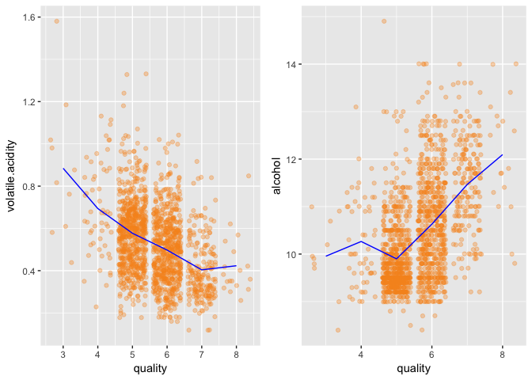

For wines with quality of 5 and more, for every unit increase in quality
the mean alcohol level rises around 1%. For wines with quality of 4 to 7
the mean volatile acidity decreases around 0.1 for each unit increase in
wine quality.

Bivariate Analysis
==================

### Talk about some of the relationships you observed in this part of the investigation. How did the features of interest vary with other features in the dataset?

-   Residual sugar, free solfur dioxide, and pH do not seem to have
    meaningful correlations with quality.
-   There is a moderate correlation between Alcohol and Quality. There
    is no poor wine with alcohol more than 12%.
-   Volatile acidity is moderately correlated with quality and it has a
    noisier plot in compare with alcohol. All wines with quality of 7 or
    more have a volatile acidity more than 1.
-   Sulphates weakly correlates with quality.
-   Since over 84% of the wines have a quality of either 5 or 6, the
    variance of quality over different level of attributes (alcohol,
    volatile acidity, sulphates, …) is not significantly different
-   For wines with quality of 5 and more, for every unit increase in
    quality the mean alcohol level rises around 1%. For wines with
    quality of 4 to 7 the mean volatile acidity decreases around 0.1 for
    each unit increase in wine quality

### Did you observe any interesting relationships between the other features?

I thought Sulphates contribute to sulfur dioxide gas levels. But not
only there is no meaningful correlation between Sulphates and Total
sulfur dioxide, but also total sulfur dioxide correlates negatively with
quality while Sulphates correlates positively.

### What was the strongest relationship you found?

The quality of wine is positively and moderately correlated with the
alcohol percentage. There is also a moderate negative correlation
between quality of wine and volatile acidity.

Multivariate Plots
==================

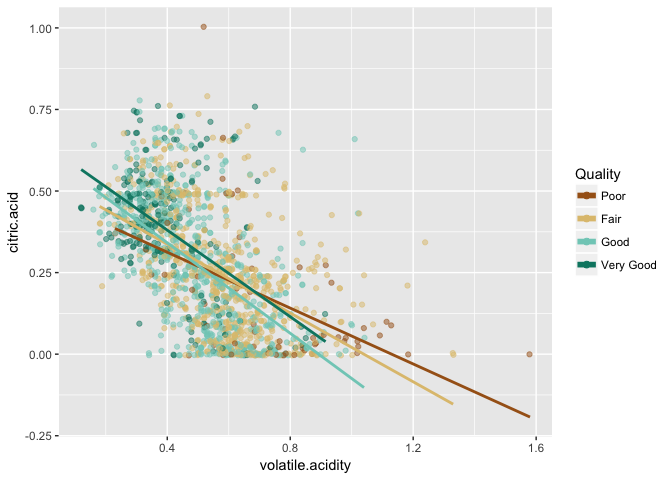

    ## [1] 0.7235023

While quality negatively correlates with volatile acidity, it positively
correlates with citric acid. As a result, Majority of ‘Very Good’
quality wines (72%) have a volatile acidity less than average (0.52) and
citric acid more than average (0.27). There is one specific outlier with
Poor quality and volatile acidity less than 0.6 and very high level of
citric acid of 1. There are also few ‘Good’ and ‘Very Good’ wines with
high volatile acidity (more than 0.8) and low citric acid (around 0.0)

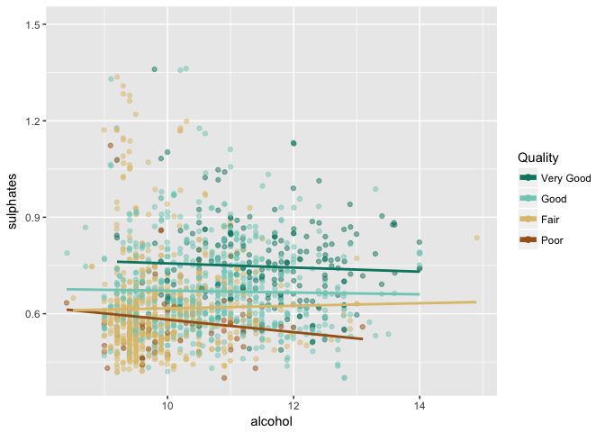

``` r
a = nrow(subset(redwine, redwine$sulphates>0.66 & 
                  redwine$alcohol>10.42 & 
                  redwine$quality>6))
b = nrow(subset(redwine, redwine$quality>6))
a/b
```

    ## [1] 0.6267281

Quality positively correlates with both alcohol and sulphates. As a
result, majority of the ‘Very Good’ quality wines (63%) have more than
average level of alcohol (10.42%) and more than average level of
sulphates (0.66). There is one specific outlier with almost 15% of
alcohol and more than 0.8 of sulphates, but it is ranks with Fair
quality. Only less than 12% of ‘Good’ wines have the alcohol less than
10 and sulphates less than 0.6

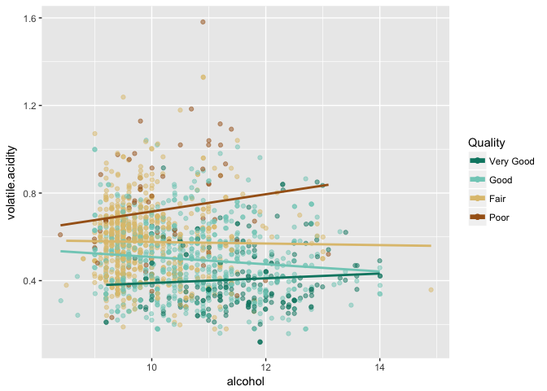

    ## [1] 0.6820276

While quality negatively correlates with volatile acidity, it positively
correlates with alcohol. As a result, Majority of ‘Very Good’ quality
wines (68%) have a volatile acidity less than average (0.52) and alcohol
percentage more than average (10.42). There is one specific outlier with
Fair quality that has a volatile acidity less than 0.4 and the level of
alcohol more than 14.

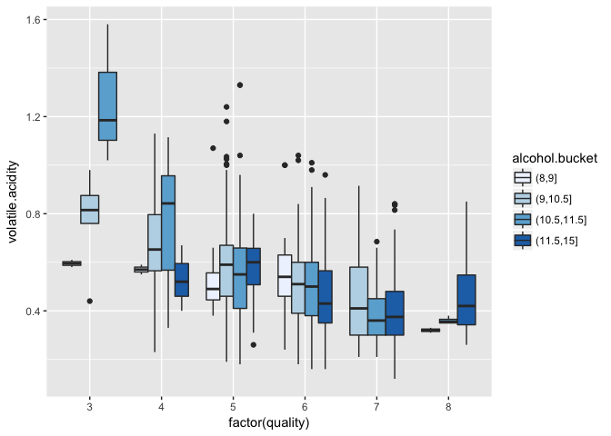

For same level of alcohol percentage, wines with lower volatile acidity
levels (less than 0.52) have usually better quality than wines with more
volatile acidity levels

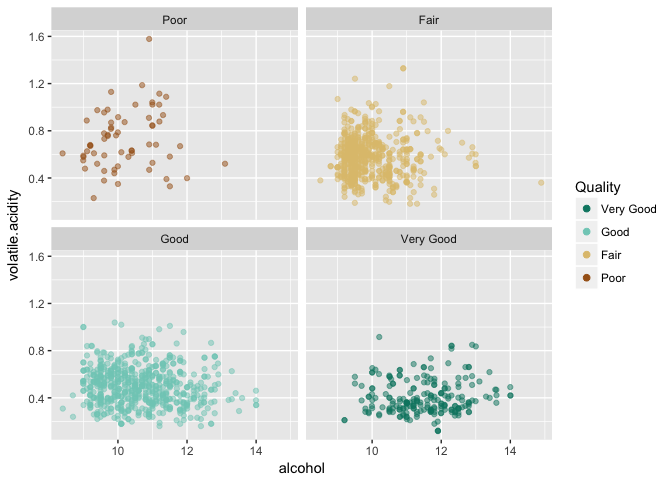

The moderate correlation between alcohol and volatile acidity is clearly
depicted in this plot. There is an apparent difference between the plots
over different levels of quality; however, the difference in not very
significant

Multivariate Analysis
=====================

### Talk about some of the relationships you observed in this part of the investigation. Were there features that strengthened each other in terms of looking at your features of interest?

Most of the ‘Very Good’ wines (wines with quality of 7 and more) have
less than average volatile acidity (0.52), more than average citric acid
(0.27), more than average sulphates (0.66), and more than average
alcohol (10.42).

Out of 11 red wine attributes, quality of wine only has a moderate
correlation with two of them. It is clear from the last two plots that
the correlation between quality and alcohol and volatile acidity is not
that strong that I could build a linear model based on those variables
to predict the quality of a red wine.

Final Plots and Summary
=======================

Plot One
--------

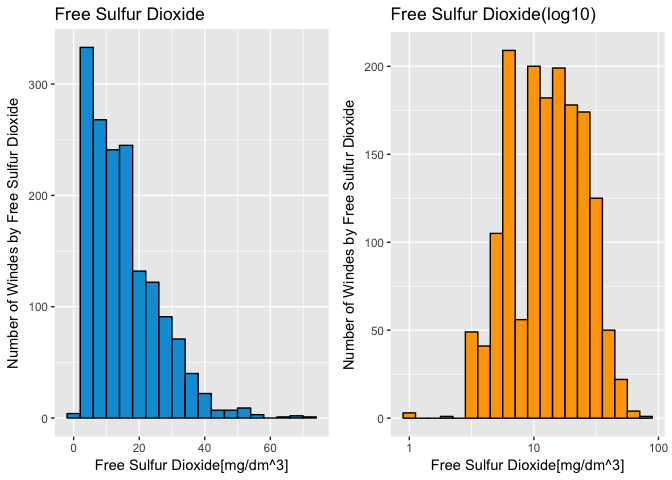

Description One
---------------

I transformed the long tail left skewed data to better understand the
distribution of free sulfur dioxide. The transformed data looks bimodal
with on peak around 6 and another peak around 10. 90% of data is less
than 30. There are 4 wines with free sulfur dioxide greater than 60
milligram per litter

Plot Two
--------

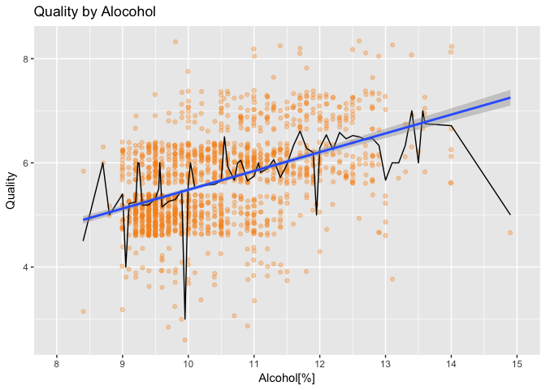

``` r
summary(redwine$volatile.acidity)
```

    ##    Min. 1st Qu.  Median    Mean 3rd Qu.    Max. 
    ##  0.1200  0.3900  0.5200  0.5278  0.6400  1.5800

Description Two
---------------

This plot shows a moderate correlation between Alcohol and Quality.
There are few outliers. Specifically, one outlier with almost 15% of
alcohol but with quality of 5. There is only one poor wine (quality 4 or
less) with alcohol more than 12%. Most of the wines with alcohol more
than 12% are ‘Good’ or ‘Very Good’ wines with quality more than 5. When
the wine alcohol increases from 9 to 12, the mean quality of wine almost
constantly increases as well; there are three exceptions: around 9, 10,
12 The variance of quality over different alcohol level is not
significantly different. One reason could be that over 84% of the wines
have a quality of either 5 or 6.

Plot Three
----------

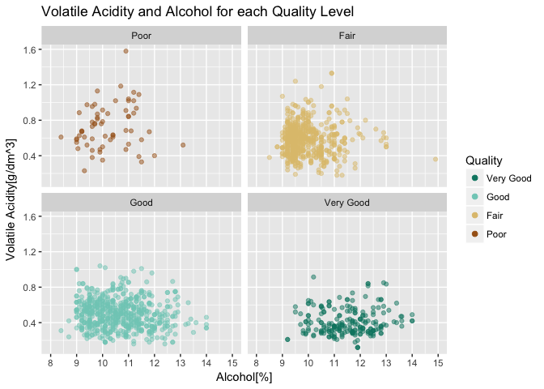

Description Three
-----------------

The moderate correlation between alcohol and volatile acidity is clearly
depicted in this plot. There is an apparent difference between the plots
over different levels of quality; Wines with Poor and Fair quality are
more spread over the volatile acidity axis than wines with Good and Very
Good quality. Majority of Very Good wines have more than 11% of alcohol,
while Majority of Poor and Fair wines have less than 11% of alcohol.

Reflection
==========

The red wine dataset contains information on 1,599 red wines across 12
variables. I started by understanding the individual variables in the
data set, and then I explored the quality of wines across several
variables; specifically, variables related to acidity and alcohol.

There is a clear trend between the alcohol or volatile acidity and the
quality score of wines. However, the correlations in both cases are
moderate at best. Among all the wine attributes, alcohol has the
strongest positive correlation with quality (0.48), and volatile acidity
has the strongest negative correlation with quality (-0.39).

Among acidity variables, those which affect the taste of the wine in a
pleasant (citric acid) or unpleasant (volatile acidity) way, have
stronger correlation with the quality. As a result, Majority of ‘Very
Good’ quality wines (73%) have a volatile acidity less than average
(0.52) and citric acid more than average (0.27). In contrast, there is
no significant correlation between fixed acidity or pH with wine
quality.

Quality positively correlates with both alcohol and Sulphates; The
majority of ‘Very Good’ wines (63%) have more than average level of
alcohol (10.42%) and more than average level of Sulphates (0.66)

I had a difficulty understanding the relation between Sulphates, Total
Sulfur Dioxide and quality of the wine. First, from the attributes
description, I thought that Sulphates can contribute to sulfur dioxide
gas levels. It was confusing because Total Sulfur Dioxide correlates
negatively with quality, and Sulphates correlates positively! But when I
checked the correlations, I found that there is no correlation between
Sulphates and Total Sulfur Dioxide.

For future investigations on wine quality, I think adding more
attributes like Tannin (the presence of phenolic compounds that add
bitterness to a wine), and Grape Types could help to build a predictive
linear model for wine quality; Moreover, the concept of “evaluations
made by wine experts” seems to be too subjective to measure the quality
of wine ([amateur vs professional wine
scores](https://www.vox.com/2016/12/15/13892364/amateur-wine-scores-critics)).
If we focus on more objective attributes like wine selling price, maybe
the correlations would be more significant, and we can build a solid
predictive linear model.
